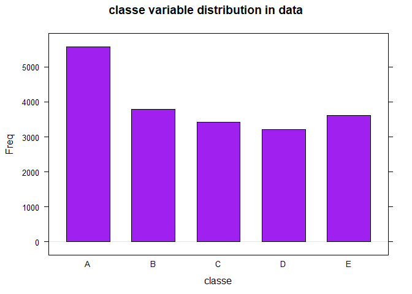
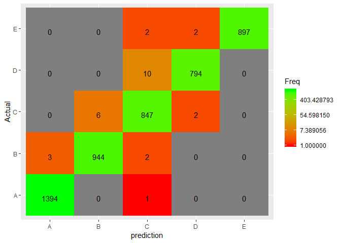

## Introduction   
Using devices such as Jawbone Up, Nike FuelBand, and Fitbit it is now possible to collect a large amount of data about personal activity relatively inexpensively. These type of devices are part of the quantified self movement – a group of enthusiasts who take measurements about themselves regularly to improve their health, to find patterns in their behavior, or because they are tech geeks. One thing that people regularly do is quantify how much of a particular activity they do, but they rarely quantify how well they do it. In this project, the goal will be to use data from accelerometers on the belt, forearm, arm, and dumbell of 6 participants. They were asked to perform barbell lifts correctly and incorrectly in 5 different ways. The goal is to predict the manner in which they did the exercise. This is the "classe" variable in the training set.    

## Data Reading  

```r
library(caret)
library(parallel)
library (lattice)
library (ggplot2)
training_url<-"https://d396qusza40orc.cloudfront.net/predmachlearn/pml-training.csv"
har_data<-read.csv(training_url)
set.seed(14)
dim(har_data)
```

```
## [1] 19622   160
```

## Data exploration, cleaning and preparation     
Checking the data set size:  

```r
dim(har_data)
```

```
## [1] 19622   160
```
From the above we can see that the data is of 19622 observations and 160 variables.  
The histogram bellow shows the distribution of the "classe" categorical variable:  

```r
barchart(har_data$classe,main="classe variable distribution in data",col="purple",horizontal=F,xlab="classe")
```

<!-- -->

For cross validation - We will split the data to training and testing sets:


```r
inTrain<-createDataPartition(y=har_data$classe, p=0.75,list=F)
training<-har_data[inTrain,]
testing<-har_data[-inTrain,]
```
First - we will remove from the data set - columns which have too many NA values:  
counting what is the ratio of NA values in each column of the training set, and checking how this values are distributed:  

```r
count_na<-apply(training, 2, function(x) sum(is.na(x))/dim(training)[[1]])
table(count_na)
```

```
## count_na
##                0 0.97893735561897 
##               93               67
```
We can see that 67 columns have 98% NAs in them, and the rest of the columns dont have any NA in them. We will remove the columns with 98% of NAs from our model, as this number is very large.   

```r
no_na_col<-which(count_na==0)
training1<-subset(training,select = no_na_col)
```
Now we have a data set with no NA, and 93 columns.   
We want to remove from data frame - factor columns that have unmeaniningfull factors like 2 levels of "" and "#DIV/0!". 
We will first print columns names that are of type factor and with less or equal to 10 levels:


```r
factor_columns<-NULL
for (i in 1:dim(training1)[2]) {
        if (is.factor(training1[,i]) & length(levels(training1[,i]))<=10) {
             factor_columns<-c(factor_columns,i)                
        }
}
str(subset(training1,select = factor_columns))
```

```
## 'data.frame':	14718 obs. of  12 variables:
##  $ user_name             : Factor w/ 6 levels "adelmo","carlitos",..: 2 2 2 2 2 2 2 2 2 2 ...
##  $ new_window            : Factor w/ 2 levels "no","yes": 1 1 1 1 1 1 1 1 1 1 ...
##  $ kurtosis_yaw_belt     : Factor w/ 2 levels "","#DIV/0!": 1 1 1 1 1 1 1 1 1 1 ...
##  $ skewness_yaw_belt     : Factor w/ 2 levels "","#DIV/0!": 1 1 1 1 1 1 1 1 1 1 ...
##  $ amplitude_yaw_belt    : Factor w/ 4 levels "","#DIV/0!","0.00",..: 1 1 1 1 1 1 1 1 1 1 ...
##  $ kurtosis_yaw_dumbbell : Factor w/ 2 levels "","#DIV/0!": 1 1 1 1 1 1 1 1 1 1 ...
##  $ skewness_yaw_dumbbell : Factor w/ 2 levels "","#DIV/0!": 1 1 1 1 1 1 1 1 1 1 ...
##  $ amplitude_yaw_dumbbell: Factor w/ 3 levels "","#DIV/0!","0.00": 1 1 1 1 1 1 1 1 1 1 ...
##  $ kurtosis_yaw_forearm  : Factor w/ 2 levels "","#DIV/0!": 1 1 1 1 1 1 1 1 1 1 ...
##  $ skewness_yaw_forearm  : Factor w/ 2 levels "","#DIV/0!": 1 1 1 1 1 1 1 1 1 1 ...
##  $ amplitude_yaw_forearm : Factor w/ 3 levels "","#DIV/0!","0.00": 1 1 1 1 1 1 1 1 1 1 ...
##  $ classe                : Factor w/ 5 levels "A","B","C","D",..: 1 1 1 1 1 1 1 1 1 1 ...
```

We can see from the above that the unmeaninfull columns names are:  
- kurtosis_yaw_belt        
- skewness_yaw_belt      
- amplitude_yaw_belt  
- kurtosis_yaw_dumbbell    
- skewness_yaw_dumbbell    
- amplitude_yaw_dumbbell   
- kurtosis_yaw_forearm  
- skewness_yaw_forearm   
- amplitude_yaw_forearm  

So excluding them from data set:


```r
poor_factors<-c("kurtosis_yaw_belt", "skewness_yaw_belt", "amplitude_yaw_belt" , "kurtosis_yaw_dumbbell",
               "skewness_yaw_dumbbell", "amplitude_yaw_dumbbell", "kurtosis_yaw_forearm", "skewness_yaw_forearm",
               "amplitude_yaw_forearm")
training1<-subset(training1,select=setdiff(names(training1),poor_factors))
```

removing near zero variance variables:   

```r
nsv<-nsv<-nearZeroVar(training1)
training1<-training1[,-nsv]
```

removing first 7 columns as they are personal data:  

```r
training1<-subset(training1,select=c(8:59))
testing1<-subset(testing,select=names(training1))
dim(training1) 
```

```
## [1] 14718    52
```
Now we have a data set that is clean, and is with 52 columns and 14718 rows.  

## Data analysis
We will fit Random Forest prediction models to our data:  


```r
mod_rf<-train(classe~.,method="rf",data=training1)
```

## Cross Validation and out of sample error  

```r
pred_rf<-predict(mod_rf,testing1)
accur_rf<-sum(pred_rf==testing1$classe)/dim(testing1)[1]
```

This model gives 99.4% accuracy.  

Bellow is the confusion matrix on the testing set.  

```r
confusion_matrix <- as.data.frame(table(pred_rf, testing$classe))
names(confusion_matrix)<-c("prediction","Actual","Freq")
g<-ggplot(data = confusion_matrix, mapping = aes(x = prediction, y = Actual))
g<-g+geom_tile(aes(fill = Freq))
g<-g+geom_text(aes(label = sprintf("%1.0f", Freq)), vjust = 1) 
g+scale_fill_gradient(low = "red", high = "green", trans = "log")
```

<!-- -->

## Predicting the test set of 20 cases:


```r
url_test<-"https://d396qusza40orc.cloudfront.net/predmachlearn/pml-testing.csv"
test_20<-read.csv(url_test)
predict(mod_rf,test_20)
```

```
##  [1] B A B A A E D B A A B C B A E E A B B B
## Levels: A B C D E
```
